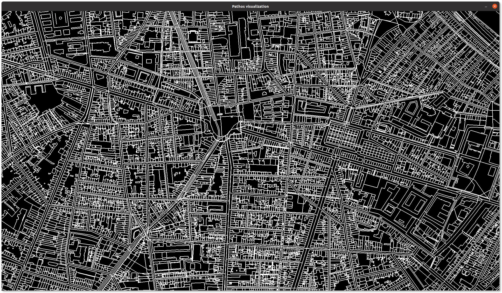

# pathos
Pathfinding experimentations to improve escape from dangerous areas

     

## Escape visualization
Helps visualize evacuation plans and their behavior on a population of points. This should not be taken a measure of the efficiency of the algorithms, it is used to get an idea of their behavior.

## Dependencies

* We're using [`pygame`](https://www.pygame.org) to render simulations.
* [`osmium`](https://osmcode.org/pyosmium/) is used to handle OpenStreetMap data files.

## License
Like this whole project, this is licensed under the Apache 2.0 license. See the corresponding "LICENSE" files to know the licenses of the different used libraries.
